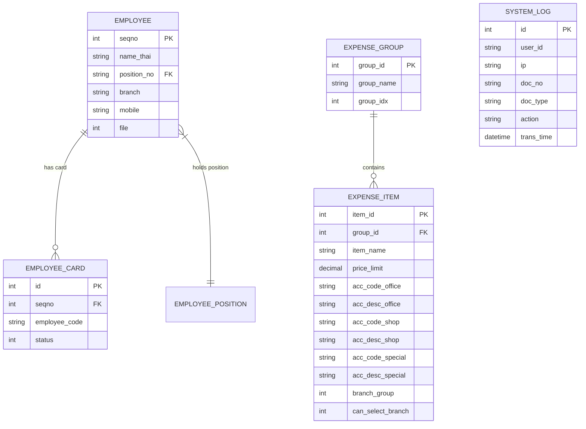

# 🏦 Expense Management System (EMS) — Modern Enterprise Edition

[](https://www.php.net/)
[](https://getbootstrap.com/)
[](https://www.mysql.com/)
[](#)

> **ระบบบริหารและจัดการหมวดหมู่ค่าใช้จ่ายองค์กร (v2.0.0)**  
> พัฒนาขึ้นสำหรับ **บริษัท ตำรับไทย สมุนไพร จำกัด (TumrubThai Herbal Co., Ltd.)** เพื่อยกระดับการควบคุม ควบคุมวงเงินเบิกจ่าย และจัดสรรผังบัญชี (Chart of Accounts) ทั้งส่วนกลาง (Office) และสาขา (Shop) อย่างเป็นระบบ

---

## 📋 สารบัญ (Table of Contents)
1. [ภาพรวมของระบบ (Overview)](#-ภาพรวมของระบบ-overview)
2. [ฟีเจอร์หลัก (Key Features)](#-ฟีเจอร์หลัก-key-features)
3. [เทคโนโลยีที่ใช้ (Tech Stack)](#-เทคโนโลยีที่ใช้-tech-stack)
4. [โครงสร้างฐานข้อมูล (Database Schema)](#-โครงสร้างฐานข้อมูล-database-schema)
5. [การติดตั้งและตั้งค่าระบบ (Installation & Setup)](#-การติดตั้งและตั้งค่าระบบ-installation--setup)
6. [บัญชีผู้ใช้ทดสอบ (Demo Accounts)](#-บัญชีผู้ใช้ทดสอบ-demo-accounts)
7. [โครงสร้างโฟลเดอร์ (Directory Structure)](#-โครงสร้างโฟลเดอร์-directory-structure)
8. [รายละเอียด API Endpoints](#-รายละเอียด-api-endpoints)
9. [การรักษาความปลอดภัยและบันทึกประวัติ (Security & Audit Logs)](#-การรักษาความปลอดภัยและบันทึกประวัติ-security--audit-logs)

---

## 🎯 ภาพรวมของระบบ (Overview)

**Expense Management System (EMS)** เป็นเว็บแอปพลิเคชันสำหรับการจัดการโครงสร้างค่าใช้จ่ายองค์กร ช่วยให้ผู้บริหาร ฝ่ายบัญชี และผู้จัดการสาขาสามารถ:
- จัดกลุ่มและควบคุมรายการค่าใช้จ่ายของบริษัทอย่างเป็นหมวดหมู่
- กำหนดเพดานวงเงินเบิกจ่ายสูงสุด (Price Limit) ในแต่ละรายการย่อย
- ผูกรหัสบัญชี (Account Code) และคำอธิบายรหัสบัญชี (Account Description) แยกตามประเภทพื้นที่ใช้งาน (สำนักงาน, สาขา, รายการพิเศษ)
- ตรวจสอบสายการบังคับบัญชาและติดต่อผู้ดูแล/หัวหน้างานแบบเรียลไทม์
- รองรับการทำงานแบบ Dual Database System (MySQL สำหรับ Production และ SQLite Auto-fallback สำหรับสภาพแวดล้อม Local / Testing)

---

## ✨ ฟีเจอร์หลัก (Key Features)

### 🔐 1. ระบบยืนยันตัวตนและการเข้าสู่ระบบ (Authentication)
* **Barcode / QR Code / รหัสพนักงาน**: สแกนบัตรพนักงานหรือป้อนรหัสเพื่อเข้าสู่ระบบอย่างรวดเร็ว
* **Quick Login (Demo Mode)**: ปุ่มคลิกเข้าสู่ระบบด่วนสำหรับสิทธิ์ผู้ใช้งานระดับต่างๆ ในขั้นตอนการทดสอบ
* **การตรวจสอบสิทธิ์และสถานะบัตร (Card Verification)**: ตรวจสอบสถานะบัตรพนักงาน (`status = 1`) และสถานะพนักงาน (`file = 0`) ก่อนอนุญาตให้เข้าใช้งาน

### 📊 2. แดชบอร์ดหลัก (Enterprise Dashboard)
* **สรุปสถิติสำคัญ (KPI Metrics)**:
  * จำนวนหมวดค่าใช้จ่ายทั้งหมด
  * จำนวนรายการค่าใช้จ่ายย่อยทั้งหมด
  * วงเงินสูงสุดต่อรายการเบิกจ่าย
  * เบอร์โทรศัพท์สายด่วนของหัวหน้างานตามสายงานหรือเขตสาขาที่สังกัด
* **ระบบค้นหาหัวหน้างานอัตโนมัติ (Supervisor Auto-Lookup)**: ค้นหาและแสดงชื่อพร้อมเบอร์ติดต่อหัวหน้างาน/ผู้จัดการเขตของพนักงานผู้ใช้งานระบบโดยอัตโนมัติ

### 🏷️ 3. ระบบจัดการหมวดและรายการค่าใช้จ่าย (Category & Item Management)
* **หมวดหมู่หลัก (Expense Groups)**:
  * เพิ่มและแก้ไขชื่อหมวดหมู่หลัก (เช่น ค่าใช้จ่ายสำนักงาน, ค่าเดินทาง, ค่าซ่อมบำรุง, ค่ารับรอง)
  * จัดลำดับการแสดงผลของหมวดหมู่ (`group_idx`)
* **รายการย่อย (Expense Items)**:
  * เพิ่ม/แก้ไข รายการย่อยภายใต้หมวดหมู่หลัก
  * กำหนดวงเงินสูงสุดต่อรายการ (`price_limit`)
  * กำหนดผังบัญชีแยก 3 มิติ:
    1. **สำนักงาน (Office Account Code & Description)**
    2. **สาขา (Shop Account Code & Description)**
    3. **กรณีพิเศษ (Special Account Code & Description)**
  * ตั้งค่าเงื่อนไขเฉพาะสาขา (`branch_group` และ `can_select_branch`)
  * รองรับการแนบไฟล์ภาพตัวอย่างสินค้า/เอกสารประกอบรายการย่อย

---

## 🛠️ เทคโนโลยีที่ใช้ (Tech Stack)

### Backend
* **Language**: PHP 7.4 / PHP 8.x (Native PHP / Modern OOP PDO Architecture)
* **Database Driver**: PDO (PHP Data Objects) พร้อมระบบ Singleton Pattern
* **Database Engines**:
  * **Production**: MySQL / MariaDB (UTF8MB4 Encoding)
  * **Development / Test Fallback**: SQLite 3 (Auto-create database & auto-seed mock data)

### Frontend & UI/UX
* **Framework**: Bootstrap v5.3.0
* **Typography**: Google Fonts (*Prompt*, *Plus Jakarta Sans*)
* **Iconography**: Bootstrap Icons (v1.11.0), FontAwesome 5/6
* **Interactivity**: jQuery v3.6.0, SweetAlert2 (Modal Dialogs & Toast Notifications)
* **Design Pattern**: Dynamic Glassmorphism, Responsive Grid System, Micro-animations

---

## 🗄️ โครงสร้างฐานข้อมูล (Database Schema)

ระบบมีตารางฐานข้อมูลหลักทั้งสิ้น 8 ตาราง ได้แก่:



### รายละเอียดตารางหลัก

1. **`expense_group`** (หมวดหมู่ค่าใช้จ่ายหลัก)
   - `group_id` (INT, Primary Key, Auto Increment)
   - `group_name` (TEXT): ชื่อหมวดหมู่
   - `group_idx` (INT): ลำดับการเรียง

2. **`expense_item`** (รายการค่าใช้จ่ายย่อย)
   - `item_id` (INT, Primary Key, Auto Increment)
   - `group_id` (INT): รหัสหมวดหมู่หลัก
   - `item_name` (TEXT): ชื่อรายการค่าใช้จ่าย
   - `price_limit` (NUMERIC): วงเงินสูงสุดต่อรายการ
   - `acc_code_office` / `acc_desc_office`: รหัสและชื่อบัญชีส่วนสำนักงาน
   - `acc_code_shop` / `acc_desc_shop`: รหัสและชื่อบัญชีส่วนสาขา
   - `acc_code_special` / `acc_desc_special`: รหัสและชื่อบัญชีส่วนงานพิเศษ
   - `branch_group` / `can_select_branch` (INT): ธงควบคุมการเลือกสาขา

3. **`employee` / `employee_card` / `employee_position`** (ข้อมูลพนักงาน บัตร และตำแหน่ง)
4. **`system_log`** (ตารางบันทึก Audit Logs)

---

## 🚀 การติดตั้งและตั้งค่าระบบ (Installation & Setup)

### 1. ข้อกำหนดของระบบ (Prerequisites)
* Web Server: Apache 2.4+ หรือ Nginx
* PHP: 7.4 หรือ 8.0+ (พร้อม PDO, pdo_mysql, pdo_sqlite extension)
* Database Server: MySQL 5.7+ / MariaDB 10.3+ (ตัวเลือกเสริม หากไม่ระบุระบบจะสลับไปใช้ SQLite อัตโนมัติ)

### 2. ขั้นตอนการติดตั้ง (Step-by-step Installation)

1. **Clone หรือดาวน์โหลดโปรเจกต์**:
   ```bash
   git clone https://github.com/your-org/expense-management-system.git
   cd expense-management-system
   ```

2. **การตั้งค่าฐานข้อมูล (`config/database.php`)**:
   ปรับเปลี่ยนค่าคอนฟิกการเชื่อมต่อ MySQL ตามสภาพแวดล้อมของคุณ:
   ```php
   $db_host = '127.0.0.1';
   $db_user = 'root';
   $db_pass = 'your_password';
   $db_name = 'tumrubthai';
   ```
   > 💡 **หมายเหตุเกี่ยวกับการทดสอบแบบ Offline / Local Development**:  
   > หากไม่พบเซิร์ฟเวอร์ MySQL ระบบจะสร้างไฟล์ฐานข้อมูล SQLite อัตโนมัติที่ `data/database.sqlite` พร้อมแทรกข้อมูลจำลอง (Mock Data) ให้ทันทีโดยไม่จำเป็นต้องนำเข้า SQL Script แต่อย่างใด

3. **การตั้งค่าแอปพลิเคชัน (`config/app.php`)**:
   ตรวจสอบและปรับเปลี่ยน `BASE_URL` หรือการตั้งค่า Session Timeout ตามต้องการ:
   ```php
   define('APP_NAME', 'Expense Management System');
   define('APP_VERSION', '2.0.0');
   ```

4. **เริ่มรัน Web Server**:
   สามารถใช้ PHP Built-in Server ในการทดสอบอย่างรวดเร็ว:
   ```bash
   php -S 127.0.0.1:8000
   ```
   จากนั้นเข้าใช้งานผ่านเบราว์เซอร์ที่: `http://127.0.0.1:8000`

---

## 🔑 บัญชีผู้ใช้ทดสอบ (Demo Accounts)

สามารถใช้รหัสพนักงานด้านล่างนี้สแกน หรือคลิกเลือกที่หน้า Login เพื่อทดสอบระบบได้ทันที:

| รหัสพนักงาน | ชื่อ-นามสกุล | ตำแหน่ง | สาขา / แผนก |
| :--- | :--- | :--- | :--- |
| **`EMP001`** | คุณสมชาย ใจดี | ผู้จัดการฝ่ายจัดซื้อ (Purchasing Manager) | สำนักงานใหญ่ (0001) |
| **`EMP002`** | คุณสมหญิง รักงาน | เจ้าหน้าที่ฝ่ายบัญชีและการเงิน | สำนักงานใหญ่ (0001) |
| **`EMP003`** | คุณมานะ มีสุข | ผู้จัดการสาขา | สาขาที่ 2 (0002) |

---

## 📁 โครงสร้างโฟลเดอร์ (Directory Structure)

```text
expense-management-system/
├── api/                         # Backend AJAX API Handlers
│   ├── add_category.php         # เพิ่มหมวดหมู่หลัก
│   ├── add_subcategory.php      # เพิ่มรายการค่าใช้จ่ายย่อย (พร้อมอัปโหลดรูป)
│   ├── update_category.php      # แก้ไขหมวดหมู่หลัก
│   └── update_subcategory.php   # แก้ไขรายการค่าใช้จ่ายย่อย
├── assets/                      # Static Assets (Images, Icons, CSS)
│   └── img/
│       └── app_logo.png
├── auth/                        # ระบบตรวจสอบการเข้าสู่ระบบ
│   ├── login.php                # ตัวจัดการสแกนบัตรและตรวจสอบสิทธิ์
│   └── logout.php               # ออกจากระบบและทำลาย Session
├── config/                      # ไฟล์ตั้งค่าระบบและฐานข้อมูล
│   ├── app.php                  # ค่าคงที่แอปพลิเคชันและ URL Path
│   ├── database.php             # PDO Connection & SQLite Auto-Fallback
│   ├── mobile_detect.php        # Library ตรวจจับอุปกรณ์พกพา
│   └── resizeimage.php          # Utility ประมวลผลรูปภาพ
├── data/                        # ที่เก็บไฟล์ SQLite Database (เมื่อทำงานในโหมด Offline)
│   └── database.sqlite
├── includes/                    # Layout Components และ Reusable Elements
│   ├── auth_check.php           # Middleware ตรวจสอบ Session ผู้ใช้
│   ├── footer.php               # HTML Footer และ Scripts
│   ├── head.php                 # HTML Head, Meta tags และ Fonts/CSS
│   └── navbar.php               # Navigation Bar และ User Profile Header
├── pages/                       # หน้าแอปพลิเคชันหลัก
│   ├── categories.php           # หน้าจัดการหมวดและรายการค่าใช้จ่าย
│   └── dashboard.php            # หน้าแดชบอร์ดหลักสรุป KPI
├── system_doc/                  # ที่เก็บไฟล์อัปโหลดประกอบรายการ
│   └── items_list/              # รูปภาพประกอบรายการค่าใช้จ่ายย่อย
├── index.php                    # หน้าแรกสำหรับเข้าสู่ระบบ (Login Entry Point)
├── .gitignore                   # ตั้งค่าไฟล์ที่ไม่ติดตามบน Git
└── README.md                    # เอกสารอธิบายรายละเอียดโปรเจกต์
```

---

## 🔌 รายละเอียด API Endpoints

ระบบใช้ AJAX ส่งข้อมูลด้วย `POST` method ไปยัง API Endpoints ต่างๆ:

### 1. `POST /api/add_category.php`
- **คำอธิบาย**: เพิ่มหมวดหมู่ค่าใช้จ่ายหลักใหม่
- **Parameters**:
  - `categoryName` (string, required): ชื่อหมวดหมู่
- **Response**: `success` หรือข้อความแสดงข้อผิดพลาด

### 2. `POST /api/update_category.php`
- **คำอธิบาย**: แก้ไขชื่อหมวดหมู่หลัก
- **Parameters**:
  - `categoryId` (int, required): ID หมวดหมู่
  - `categoryName` (string, required): ชื่อหมวดหมู่ใหม่
- **Response**: `success` หรือข้อความแสดงข้อผิดพลาด

### 3. `POST /api/add_subcategory.php`
- **คำอธิบาย**: เพิ่มรายการค่าใช้จ่ายย่อยใหม่ภายใต้หมวดหมู่
- **Parameters**:
  - `categoryId` (int, required)
  - `subcategoryName` (string, required)
  - `price_limit` (float)
  - `acc_code_office`, `acc_desc_office` (string)
  - `acc_code_shop`, `acc_desc_shop` (string)
  - `acc_code_special`, `acc_desc_special` (string)
  - `branchGroup`, `canSelectBranch` (int)
  - `subcategoryImage` (file, optional): รูปภาพประกอบรายการ
- **Response**: `success` หรือข้อความแสดงข้อผิดพลาด

### 4. `POST /api/update_subcategory.php`
- **คำอธิบาย**: อัปเดตข้อมูลรายการค่าใช้จ่ายย่อย
- **Parameters**:
  - `subcategoryId` (int, required)
  - `subcategoryName` (string, required)
  - `price_limit` (float)
  - `acc_code_office`, `acc_desc_office` (string)
  - `acc_code_shop`, `acc_desc_shop` (string)
  - `acc_code_special`, `acc_desc_special` (string)
  - `branchGroup`, `canSelectBranch` (int)
  - `subcategoryImage` (file, optional): รูปภาพประกอบใหม่
- **Response**: `success` หรือข้อความแสดงข้อผิดพลาด

---

## 🛡️ การรักษาความปลอดภัยและบันทึกประวัติ (Security & Audit Logs)

1. **PDO Prepared Statements**: คำสั่งค้นหาและจัดการฐานข้อมูลทั้งหมดใช้ Prepared Statements เพื่อป้องกันปัญหา **SQL Injection**
2. **XSS Protection**: การแสดงผลข้อมูลฝั่ง Client มีการแปลงอักขระพิเศษด้วย `htmlspecialchars()`
3. **Audit Trail Log**: ทุกการเข้าใช้งานและการทำรายการสำคัญจะถูกบันทึกลงในตาราง `system_log` ผ่านฟังก์ชัน `history()` โดยระบุ:
   - ชื่อผู้ใช้งาน (`user_id`)
   - หมายเลขอินเทอร์เน็ตโปรโตคอล (`ip`)
   - รหัสเอกสาร / ประเภทเอกสาร (`doc_no`, `doc_type`)
   - การกระทำที่เกิดขึ้น (`action`)
   - เวลาที่เกิดรายการ (`trans_time`)

---

## 📄 ลิขสิทธิ์ (License)

สงวนลิขสิทธิ์ © **บริษัท ตำรับไทย สมุนไพร จำกัด (TumrubThai Herbal Co., Ltd.)**  
ห้ามมิให้ทำซ้ำ ดัดแปลง หรือเผยแพร่ส่วนหนึ่งส่วนใดของซอฟต์แวร์นี้ก่อนได้รับอนุญาตเป็นลายลักษณ์อักษร
